# Formatly

Formatly is an AI document workspace with two halves that meet in the middle.

**Compose** turns notes into a fully styled paper or report. **Document OS** opens a
document — one Formatly wrote, or a `.docx` you already had — and lets you keep
editing it in plain English: *"put the contributions in bullets"*, *"only the top
and bottom borders, bold"*, *"increase the headings by 2"*.

The rule that shapes everything below: **the model never writes the document.** It
emits JSON describing what to do. A validator checks it, a deterministic engine
applies it, and every change is versioned and reversible.

**Local URLs** — UI <http://localhost:5173> · API docs <http://127.0.0.1:8000/docs> ·
health <http://127.0.0.1:8000/health>

---

## Contents

1. [Quick start](#quick-start)
2. [The two products](#the-two-products)
3. [Document OS: the four engines](#document-os-the-four-engines)
4. [The document model](#the-document-model)
5. [Import: a .docx becomes a graph](#import-a-docx-becomes-a-graph)
6. [Understanding a command](#understanding-a-command)
7. [The action language](#the-action-language)
8. [Execution](#execution)
9. [Versions](#versions)
10. [Live events](#live-events)
11. [Rendering and pagination](#rendering-and-pagination)
12. [Export](#export)
13. [Mathematics, both ways](#mathematics-both-ways)
14. [Compose](#compose)
15. [Accounts and ownership](#accounts-and-ownership)
16. [HTTP and WebSocket API](#http-and-websocket-api)
17. [Configuration](#configuration)
18. [Data on disk](#data-on-disk)
19. [Testing](#testing)
20. [Troubleshooting](#troubleshooting)
21. [Design invariants](#design-invariants)

---

## Quick start

Prerequisites: **Python 3.14** (3.11+ works), **Node 20+**, and optionally
**LibreOffice** for exact-layout PDF.

```bash
# backend
cd backend
python -m venv .venv
.venv/Scripts/python.exe -m pip install -r requirements.txt   # POSIX: .venv/bin/pip
cp .env.example .env        # add MISTRAL_API_KEY
.venv/Scripts/python.exe -m uvicorn app.main:app --host 127.0.0.1 --port 8000

# frontend, in another shell
cd frontend
npm install
npm run dev
```

Without an API key the app still runs: the editor falls back to its rule-based
command reader, which handles most ordinary instructions on its own (see
[Understanding a command](#understanding-a-command)).

```bash
cd backend && .venv/Scripts/python.exe -m pytest -q     # 641 tests
```

---

## The two products

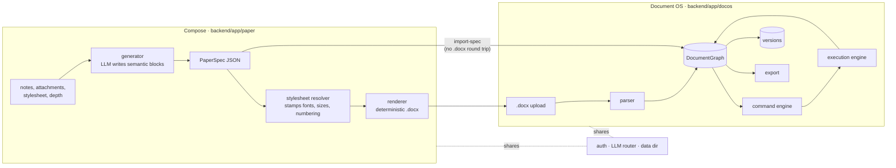

A composed document can enter Document OS **without** going through a `.docx`
first. Going through a file would flatten what the spec knows — a listing into
loose paragraphs, an equation into whatever characters it typeset to — because
DOCX has no word for either.

---

## Document OS: the four engines

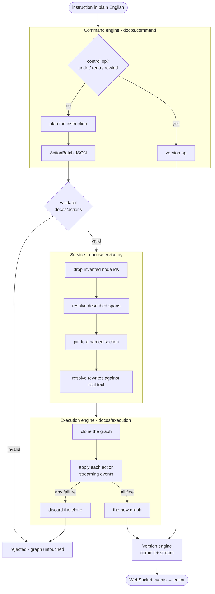

| Engine | Package | Job |
|---|---|---|
| **Document** | `docos/graph`, `docos/parser` | Typed node tree; DOCX → graph; optional LibreOffice pagination |
| **Command** | `docos/command` | Instruction → control op or validated `ActionBatch` |
| **Execution** | `docos/execution` | **Sole mutator.** Clone, apply, stream, roll back on failure |
| **Version** | `docos/versioning` | SQLite history; snapshot every 10, replay actions between |

Deeper notes live in `backend/app/docos/ARCHITECTURE.md`.

---

## The document model

A document is a tree of typed nodes. Nothing about layout is inferred — every
value is one the file stated, converted to the units the model uses: **inches**
for widths, **points** for type and rules, **hex** for colour.

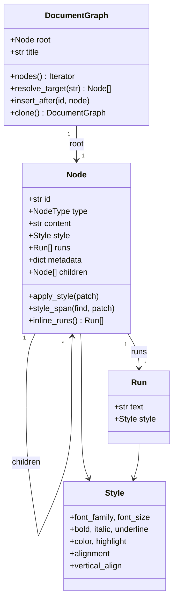

**17 node types** — `document`, `paragraph`, `heading`, `subheading`, `body`,
`image`, `figure`, `caption`, `table`, `table_row`, `table_cell`,
`horizontal_rule`, `page_break`, `header`, `footer`, `reference`, `footnote`.

**Runs** are why a paragraph can be half bold. `style` is the paragraph's own
formatting; `runs` describe it piece by piece. Runs that no longer spell out
`content` are ignored rather than trusted, so a rewrite cannot leave stale
formatting attached to words that are gone.

**`metadata`** carries everything Word states that is not a style:

| Key | Means |
|---|---|
| `list` | `{kind: bullet\|number, level}` — a bullet is a property of the paragraph, not characters typed into it |
| `borders` | a table's six edges in points, plus `header` for the rule under the heading row |
| `columns_in`, `width_in`, `align`, `cell_pad_in` | a table's geometry |
| `shade`, `valign`, `span`, `vmerge` | one cell's shading, placement and merging |
| `line_spacing`, `space_before_pt`, `space_after_pt`, `indent_*_pt` | paragraph spacing |
| `equations` | the original OMML for an equation nobody has edited |
| `header_row` | the row a table treats as its heading |

---

## Import: a .docx becomes a graph

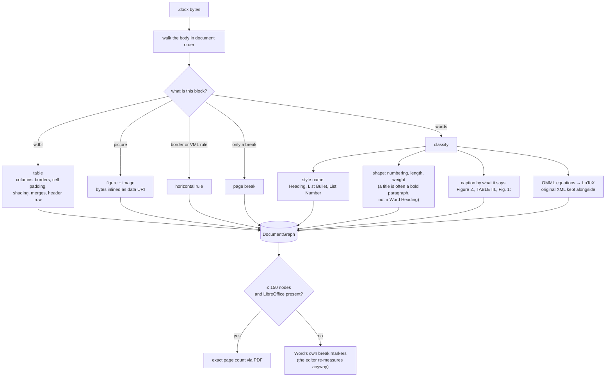

Two things the parser learned the hard way, both because a document says them in
more than one place:

- **Lists** live in a `List Bullet`/`List Number` *style* or an inline `w:numPr`.
  `List Paragraph` alone is not a list — Word gives that style to any indented
  block, and reading it as one put a bullet on the sentence introducing the list.
- **Table borders** are usually stated by the table's *style*, not on the table.
  Reading only the table's own XML reported no edges at all, and the editor then
  drew a full grid whatever the style said.

---

## Understanding a command

An instruction gets three chances, in falling order of context and rising order
of certainty that an answer comes back at all.

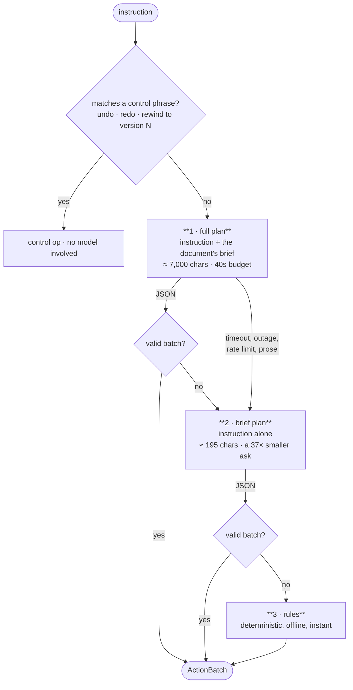

**Why three.** The planner reads rewording perfectly — *"squash the gap between
paragraphs"*, *"put a line under the header row of each table"* — and answers in
about a second and a half. What used to be brittle was the path taken when it
answered at all: the rules match *words*, so a synonym was a different request to
them. The brief plan exists because what times out is not the instruction but the
document's brief travelling with it.

The panel always says which of the three answered, and why the others did not.

**The rules on their own** handle: weight and slope, colour, highlight, all four
alignments, size as a number / a step (`by 2`) / a direction (`larger`), bullets
and numbering, letter case, line spacing and paragraph gaps, typeface, table
borders (including *"keep the top and bottom, removing the left and right"*),
phrases named outright, and deletion of a class of thing. Anything they cannot
place goes to the rewriter rather than being dismissed.

### Placing an instruction in the document

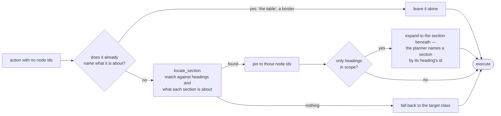

---

## The action language

Every instruction becomes an `ActionBatch`: a short reasoning string and a list of
actions. **21 action types:**

```
align  border  case  copy  delete  format  highlight  insert  justify  list
merge  move  normalize  paste  render_maths  replace  resize  rewrite  select
spacing  split
```

```jsonc
{
  "reasoning": "…",
  "actions": [{
    "type": "format",
    "target": "heading",          // a class of thing, or…
    "node_ids": ["n_a1b2c3"],     // …exactly these nodes
    "style":  { "bold": true },
    "params": { "find": "MobiAct" }
  }]
}
```

**18 targets** — `body`, `caption`, `document`, `figure`, `footer`, `footnote`,
`header`, `heading`, `horizontal_rule`, `image`, `page_break`, `paragraph`,
`reference`, `subheading`, `table`, `table_cell`, `table_header`, `title`.

Three of those are roles rather than node types: `table_header` (the cells of a
header row), `title` (the first thing the document says, heading or not), and
`document` (everywhere words are — for a phrase that could be anywhere).

**Notable params**

| Action | Params | Note |
|---|---|---|
| `format` | `find` / `describe` / `spans` | a quoted phrase is searched for; a *described* one is resolved by a model and each span checked against the real text before use |
| `resize` | `font_size` \| `delta` \| `scale` | `12 pt`, `by 2`, and `larger` are three different requests; a "size" under 5 pt is read as a misplaced step |
| `list` | `kind: bullet\|number\|none`, `level` | splits an enumerating paragraph into its items |
| `border` | `sides` (list or side→width map), `width` | naming sides means those **and no others** |
| `case` | `kind: upper\|lower\|title\|sentence` | mechanical, so no model is asked |
| `spacing` | `line`, `before_pt`, `after_pt` | |

**Validation** rejects unknown targets, missing scope, malformed params, and
refuses to delete every paragraph in a document without explicit confirmation.
An invalid batch never reaches the graph.

---

## Execution

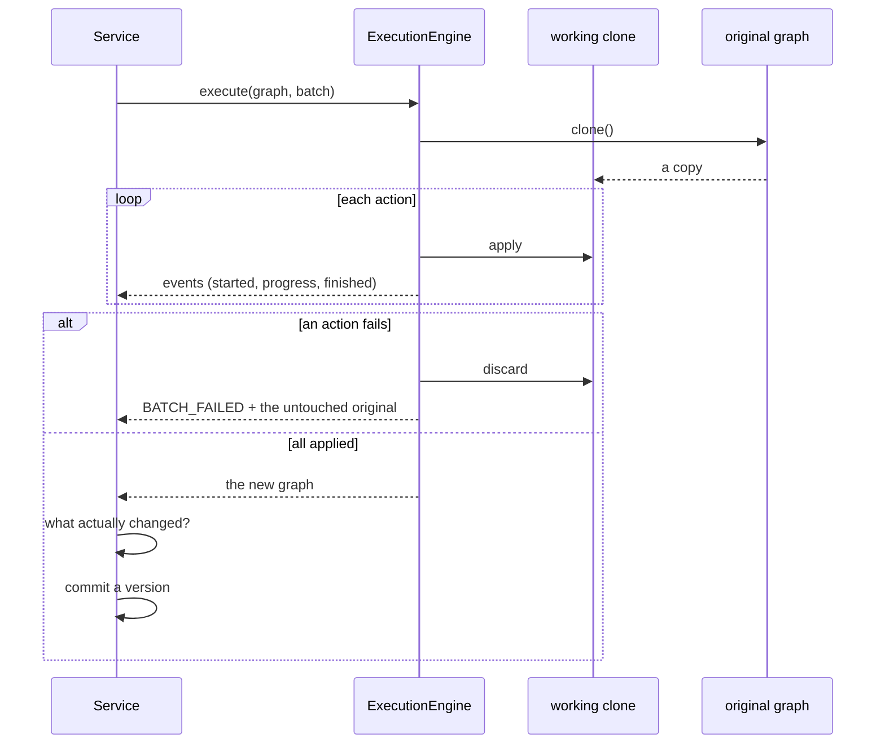

The executor is the only code that mutates a graph. It works on a clone, so a
failure halfway through leaves nothing half-done. Two details that took several
bugs to get right:

- **What changed** compares content, style, *runs* and *metadata*. Comparing only
  text and style called a bolded word, a bullet and a table border "nothing".
- **A table has no words of its own.** Text formatting aimed at a table expands to
  its cells; alignment does not, because a table is aligned as a block.

---

## Versions

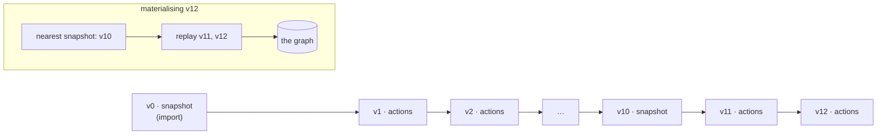

Every version stores its **action batch**; every tenth stores a **full snapshot**.
A version is materialised by taking the nearest snapshot and replaying forward,
which is why a rewrite records its *resolved text* rather than its instruction —
asking a model again would give different words every time.

| Operation | Effect |
|---|---|
| **undo** / **redo** | move along the chain |
| **rewind** | move the head to an earlier version |
| **restore** | make an earlier version the *newest* one, keeping the history between |
| **compare** | word-level diff of two versions, with before/after text per node |

`restore` takes a snapshot of its own: its batch is empty, so replaying it would
otherwise reproduce the parent instead of the version asked for.

---

## Live events

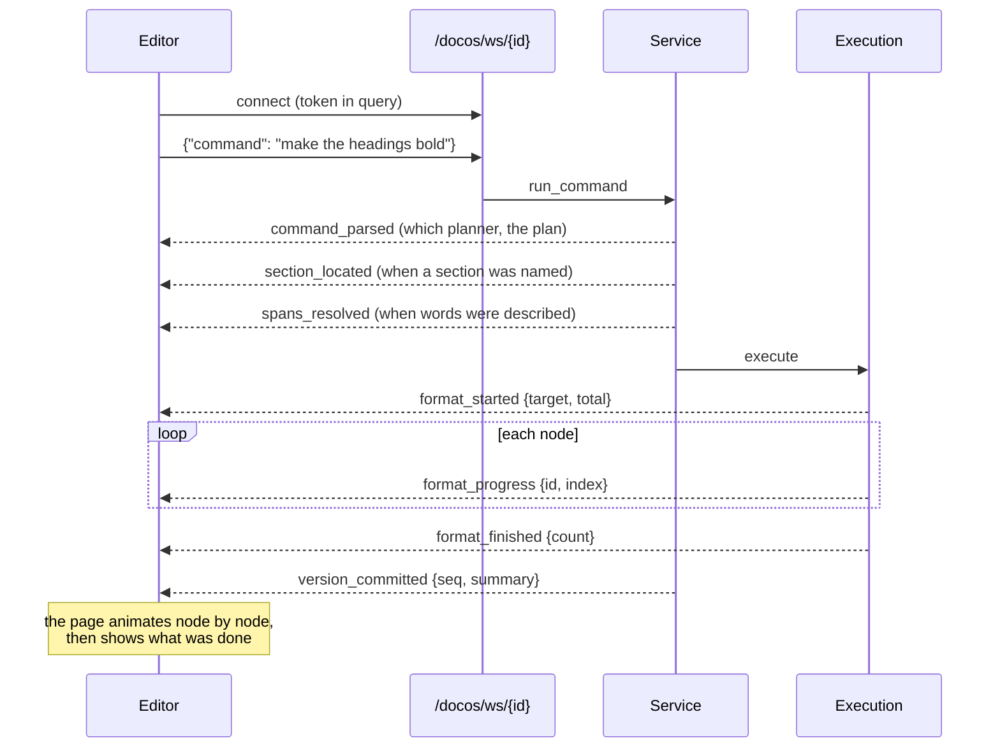

The line under **Done** is built from the actions that ran and the nodes that
actually changed — *"Bolded "GBP 2.41" and "GBP 2.66" in Executive Summary"*,
*"Bulleted 4 paragraphs"*, *"Drew heavy top and bottom borders on 10 tables, and
no others"*. It used to show the planner's own reasoning, which is a note the
planner writes to itself about node ids, and which read the same whether anything
had happened or not.

---

## Rendering and pagination

The editor draws the document itself rather than embedding a viewer, so every
node stays addressable and every change animates in place.

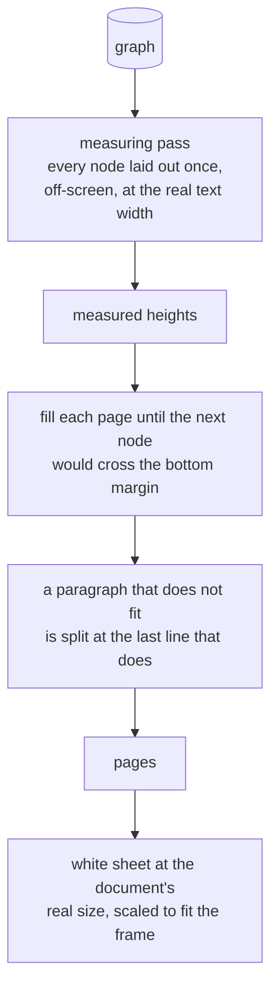

Word's saved break markers are only the starting point: they describe the layout
of the machine that last saved the file. What the page shows is measured.

Fidelity details that each cost a visible bug: type is drawn in **points**, not
pixels; Word's line-spacing multiple is a multiple of the font's *own* line
height, not of its size; a table uses the document's cell padding (0.075″ at the
sides, none above) rather than the editor's; and a cell is set in the document's
type, not a fixed 10pt.

**Exact view** is a different answer to the same question: LibreOffice renders the
*current* graph to PDF, so it shows real Word pagination including your edits.

---

## Export

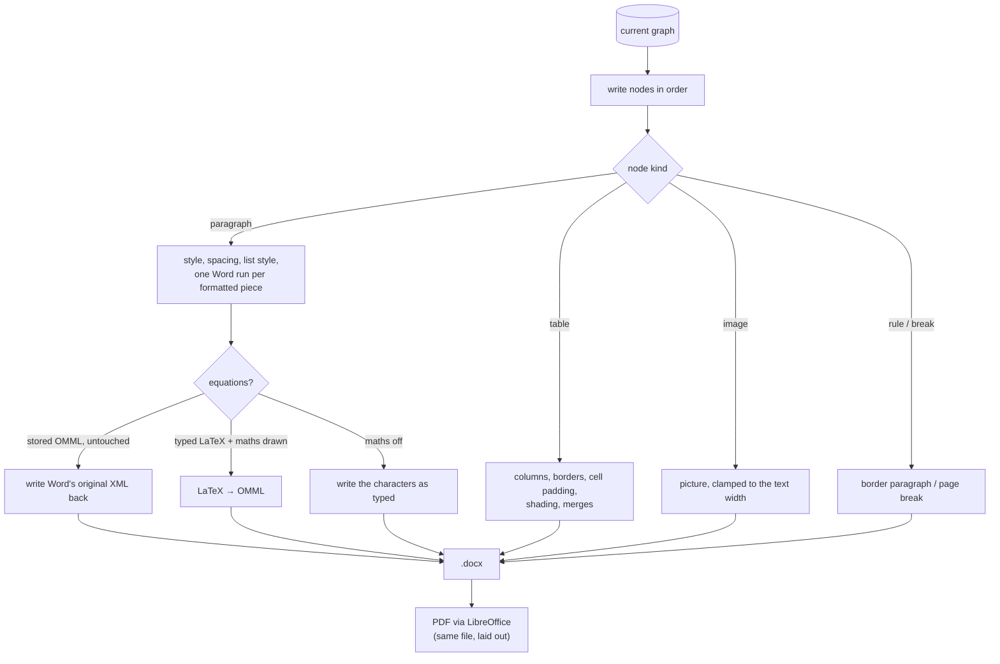

### The schema is an order, not just a set

Word validates the **sequence** of elements inside a property container. All three
of these are well-formed XML and a file Word refuses to open, saying only *"we
found a problem with its contents"*:

| Wrong | Right |
|---|---|
| `w:tblBorders` after `w:tblLayout` | before it |
| `w:tcBorders` after `w:vAlign` | before it |
| edges written top, bottom, left, right | top, **left**, bottom, right, insideH, insideV |

A fourth: OMML has no bare group — `m:e` is part of a structure, never a thing on
its own, and one sitting straight inside an `m:oMath` invalidates the document.

None of this is caught by round-tripping through our own parser, and LibreOffice
opens all four broken variants happily. `tests/test_docx_is_valid.py` asserts the
order over a document that uses every part of the exporter at once.

---

## Mathematics, both ways

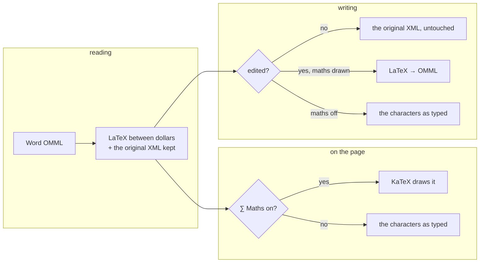

Reading and writing are separate converters (`parser/omml.py`,
`parser/omml_write.py`). The writer covers what a paper uses — fractions, powers
and indices, roots, sums and integrals with limits, bracketed groups, Greek,
operators, upright function names. A command it does not know is written out as
typed rather than guessed at, so an exotic formula degrades to how it looked
before instead of coming out wrong.

Converting equations to *prose* was tried and removed: it is lossy, irreversible,
costs a model call per page, and cannot be undone by looking at the result.
Drawing them is a display change that alters no words.

---

## Compose

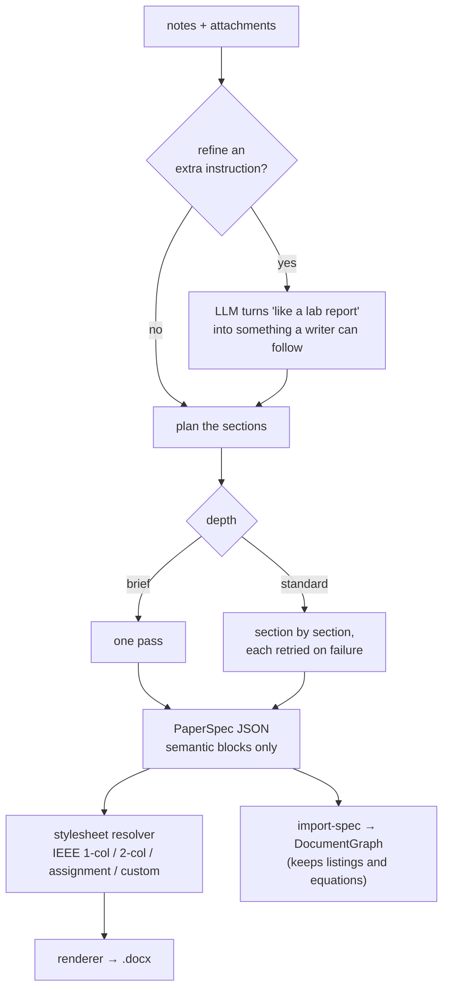

The model emits **semantic** blocks — heading, paragraph, table, equation,
listing, figure — and never layout. The stylesheet stamps fonts, sizes, numbering
and captions afterwards, so the same spec can be set as an IEEE paper or a formal
assignment without asking the model again.

---

## Accounts and ownership

- Sign up / log in; the token lives in `localStorage` as `docos.token` and is sent
  as `Authorization: Bearer …`. The WebSocket takes it as a query parameter.
- Papers and documents are **owner-scoped**. A stranger's id is `403`, an unknown
  id is `404`; neither reports success.
- Deleting is checked the same way, including *Delete all*, which lists only the
  caller's own documents and deletes them by id.

---

## HTTP and WebSocket API

All DocOS and paper routes take a Bearer token.

### Documents

| Method | Path | Does |
|---|---|---|
| `GET` | `/docos` | list your documents |
| `POST` | `/docos/import` | upload a `.docx` |
| `POST` | `/docos/import-spec` | import a composed spec directly |
| `GET` | `/docos/{id}` | the current graph |
| `DELETE` | `/docos/{id}` | delete one, with its history |
| `DELETE` | `/docos` | delete **all** of yours |
| `GET` | `/docos/{id}/download.docx?maths=1` | export; `maths=1` writes typed LaTeX as equations |
| `GET` | `/docos/{id}/download.pdf?maths=1` | the same file, laid out by LibreOffice |
| `GET` | `/docos/{id}/exact.pdf` | exact view of the current graph |
| `GET` | `/docos/{id}/brief` | what the document is: kind, sections, inventory |
| `POST` | `/docos/{id}/read` | read it through, section by section |
| `GET` | `/docos/{id}/history` | versions |
| `GET` | `/docos/{id}/diff?a=3&b=7` | word-level diff |
| `POST` | `/docos/{id}/command` | run an instruction (non-streaming) |
| `WS` | `/docos/ws/{id}?token=…` | run instructions and receive events |

### Auth

`POST /auth/signup` · `POST /auth/login` · `GET /auth/me` · `POST /auth/password`

### WebSocket messages

```jsonc
// → server
{ "command": "make the headings bold" }

// ← server, in order
{ "event": "command_parsed",    "payload": { "source": "llm", "actions": [...] } }
{ "event": "format_started",    "payload": { "target": "heading", "total": 7 } }
{ "event": "format_progress",   "payload": { "id": "n_…", "index": 0 } }
{ "event": "format_finished",   "payload": { "count": 7 } }
{ "event": "version_committed", "payload": { "seq": 12, "summary": "Bolded 7 headings." } }
```

---

## Configuration

`backend/.env`:

| Variable | Meaning |
|---|---|
| `MISTRAL_API_KEY` | the planner and rewriter; without it the rules answer everything |
| `MISTRAL_MODEL` | default `mistral-medium-latest` |
| `MISTRAL_LIGHT_MODEL` | comma-separated ladder of smaller models to try when the main one is busy; empty turns it off |
| `DOCPILOT_DATA_DIR` | where documents and the database live |

The router keeps a per-provider cooldown, retries on 429/5xx, walks down the
model ladder on 403/404 (a plan the account cannot run), and gives up rather than
hanging. Every failure reason travels back to the panel.

**Frontend** — `VITE_API_URL` (defaults to `http://127.0.0.1:8000`).

---

## Data on disk

```
backend/.data/
├── docos.db          documents, versions, users, saved styles (SQLite)
├── documents/        generated .docx and PDF
├── templates/        saved stylesheets
├── charts/           generated figures
└── secret.key        token signing key
```

The test suite runs against a temporary directory of its own, so it can never
leave documents in yours.

---

## Testing

**641 tests.** Two of them are sweeps rather than examples, because every bug in
the command area had one of two shapes.

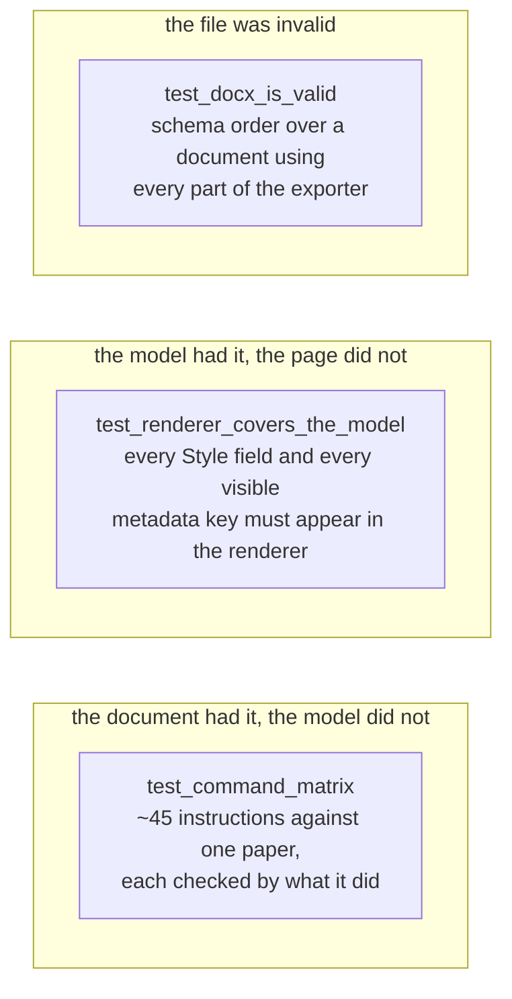

The matrix runs **offline**, so it tests the rules rather than the model's mood:
a phrasing that stops being understood fails there rather than in front of
someone. The renderer sweep is deliberately coarse — an edit that silently fails
to apply leaves no other trace, which is exactly how table borders once shipped
working in the model and invisible on the page.

Other suites cover the parser, export fidelity, versioning, the router's
fallbacks, spans, lists, table layout, typed emphasis, and the equation
converters in both directions.

```bash
cd backend && .venv/Scripts/python.exe -m pytest -q
cd frontend && npx tsc --noEmit -p tsconfig.app.json && npm run lint
```

---

## Troubleshooting

| Symptom | Cause |
|---|---|
| **Word: "we found a problem with its contents"** | an element written out of schema order — see [Export](#export). LibreOffice will open the same file happily |
| **"The planner could not be used… this plan is a fallback"** | the model timed out or the account cannot use it; the rules answered instead. The panel names the reason |
| **A command reports "the document already looks that way"** | it found its scope and had nothing to do. If that seems wrong, the scope was wrong — check `section_located` in the events |
| **Exact view or PDF fails** | LibreOffice is not installed or not on `PATH` |
| **Equations show as `$…$`** | the ∑ Maths toggle is off; it governs the page *and* the download |
| **Pages differ from Word** | the editor measures its own layout; Exact view is the authority |

---

## Design invariants

These are the rules the code is arranged around. Most were learned by breaking
them.

1. **The model never writes the document.** It emits JSON; a validator checks it;
   a deterministic engine applies it.
2. **One mutator.** Only the execution engine changes a graph, on a clone, with
   rollback.
3. **Everything is reversible.** A version stores resolved actions, not
   instructions, so replay is deterministic.
4. **A change nobody can see is a bug**, even if the model, the file and the
   history all agree it happened.
5. **Say what happened, not what was intended.** The outcome line is built from
   what changed.
6. **Degrade, don't fail.** No API key, no LibreOffice, an unknown LaTeX command,
   a provider outage — each loses one capability, not the app.
7. **Read the document, don't guess at it.** Every layout value is one the file
   stated; where a document says something two ways, read both.
